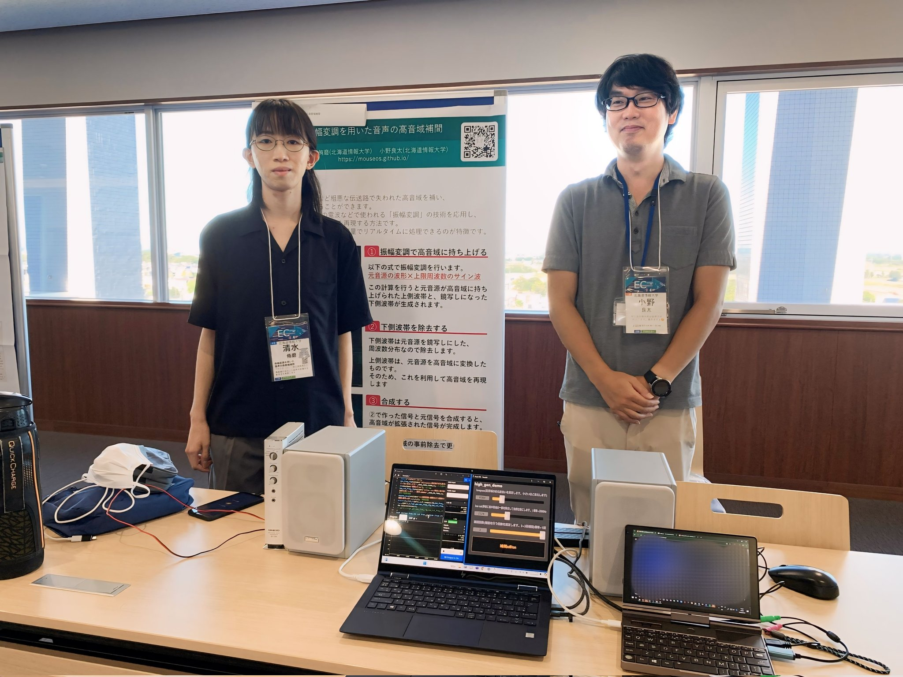
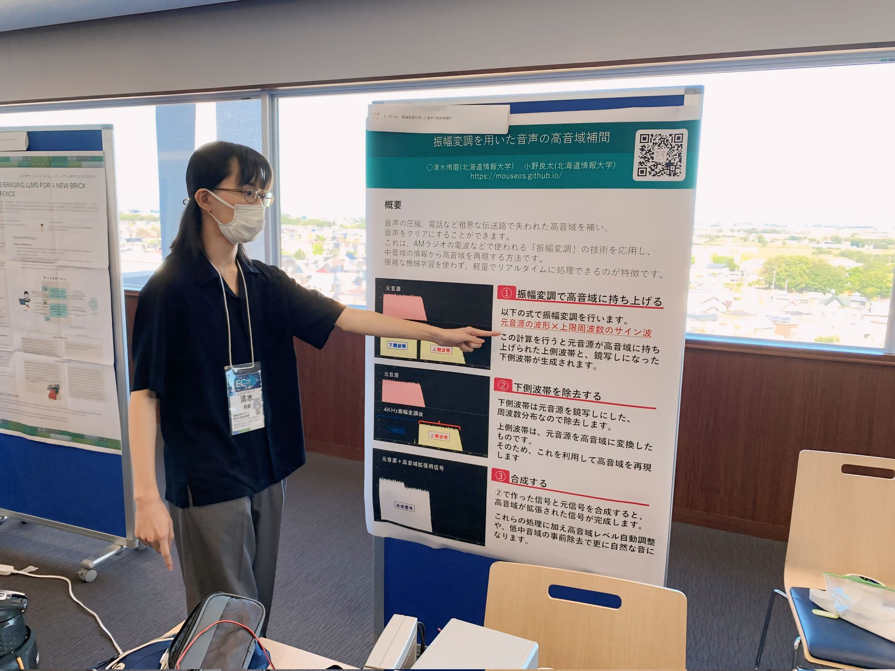
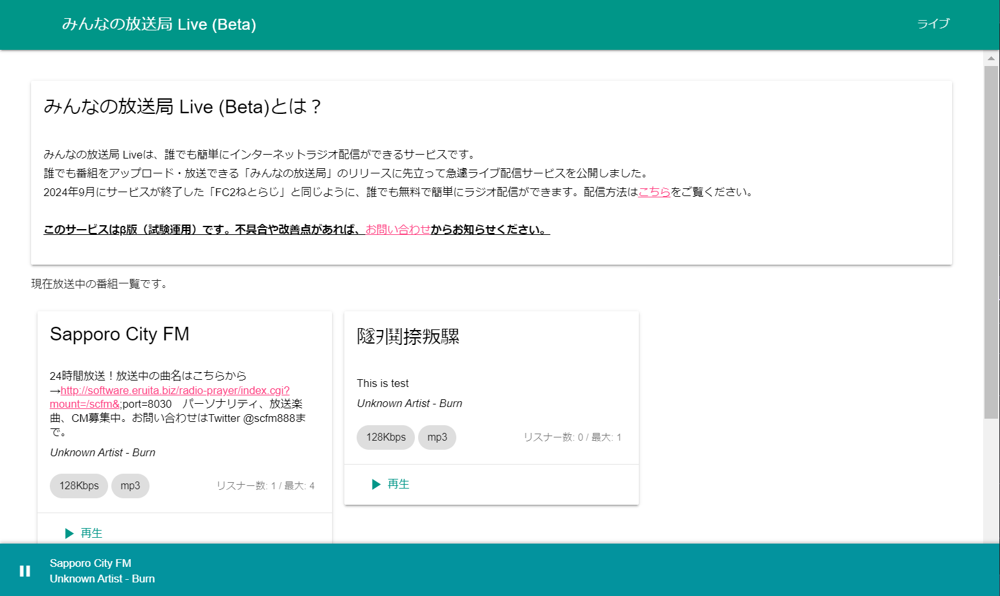
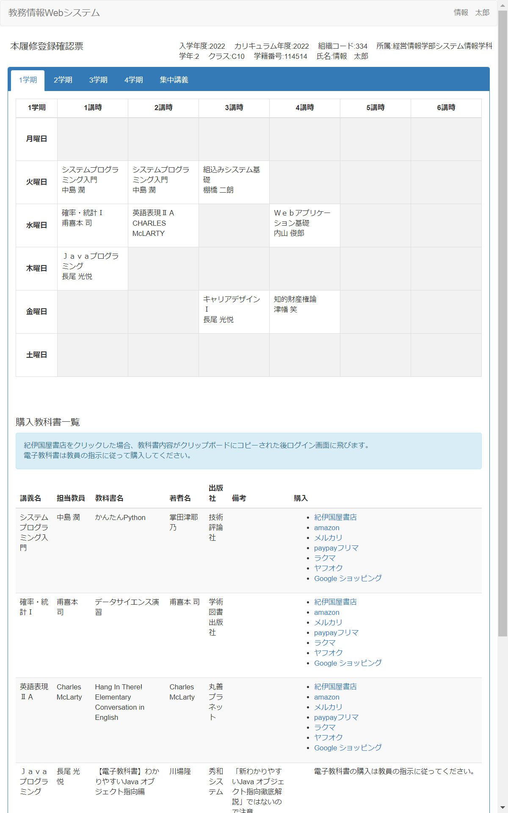

# プロフィール
## 名前
清水 侑磨(ネット上：ゆう)
## 生年月日
2003/07/26
## 主な活動地域
札幌市 江別市
## 大学
北海道情報大学経営情報学部システム情報学科　小野ゼミ
## アカウント
### github
[mouseos](https://github.com/mouseos)
### Twitter
[mouse_soft_y](@mouse_soft_y)
## 資格
ITパスポート

基本情報技術者試験は勉強中

## 論文・学会発表
### 情報処理学会EC2024 「振幅変調を用いた音声の高音域補間」
近年、SNSや各種配信サービス上でユーザーが動画や音声をアップロードする機会が増加している。しかし、これらのサービスでは音声ファイルが圧縮されることが多い。それに加え、粗悪な機材での収録など多くの要因で高音域が欠落し、音質に問題のある音声も多く見受けられる。本稿では、このような音声の高音域を補間し音質を改善する方法について考察する。

[清水 侑磨, 小野 良太. (2024). 音声の高音域補間による音質改善. エンタテインメントコンピューティングシンポジウム2024論文集, 391-394. 北海道情報大学.](https://ipsj.ixsq.nii.ac.jp/ej/index.php?active_action=repository_view_main_item_detail&page_id=13&block_id=8&item_id=238751&item_no=1)

[動作デモ(YouTube)](https://youtu.be/Nnlo8ypgmZo?si=Cx9BT7zonbevIMon)

## 受賞歴
### 北海道情報大学プログラミングコンテスト2022 ラジャマンガラ工科大学国際プログラミングコンテスト
最優秀賞
音声自動調整ソフト　「RadiMod」

### 北海道情報大学プログラミングコンテスト2023
最優秀賞
気象情報番組自動生成ソフト

### 北海道情報大学ウェブデザインコンテスト2023
優秀賞
実際に体験してネット上での危険を学ぶ「ウェブアドベンチャー」
[ウェブアドベンチャー](https://mouseos.github.io/wdc2023)

### ラジャマンガラ工科大学ウェブデザインコンテスト2023
3位
同上

### 北海道情報大学競技プログラミング
5位

## その他
### 留学
タイ ラジャマンガラ工科大学(RMUTT)短期留学
2022,2023

### 使用できるプログラミング言語
実用的なものを作ったことがある

python,JavaScript,CSS,PHP,html,faust,シェルスクリプト

※htmlはプログラミング言語ではなくマークアップ言語

使ったことがある

Java,C++,csound,povray,puredata,small basic

# 運営サイト、サービス

画像クリックで関連サイトに飛びます

## みんなの放送局　（現Sapporo City FM）
主にネット上で活動しているインターネットラジオ局です。
24時間ストリーミング放送と一部公共施設内で放送を行う予定です。
誰もが番組を持つことができる「みんなが参加できる放送局」を目指して放送をします。

このサービスはまだリリースされていません。最新情報はTwitterで順次公開していきます。 
[Twitter](https://twitter.com/scfm888)
（現 インターネット放送局Sapporo City FMアカウント）

### みんなの放送局 Live
2024年9月にサービスを終了したねとらじの代替サービスです。メインサービスに先立って公開する予定です。

## 制作ソフト(無償配布)
画像クリックでダウンロードページヘ飛びます

### HIU教科書購入支援ツール
北海道情報大学eduwebの時間割画面に購入するべき教科書一覧を表示します。

## mousesoft
実際のテレビ、ラジオ局で使用されているものを元にした配信者向けソフトを販売中です。

画像クリックで購入ページヘ飛びます
[mousesoft(booth)](https://mousesoft.booth.pm)

### 【OBS用】 時計＆天気　インフォバー

### 【OBS用】　地震情報テロップ

### 【OBS用】TV天気ループウィジェット

### 【OBS用】TV天気予報ウィジェット

### 【OBS用】簡単カスタマイズ時計

### 【OBS用】　津波情報ウィジェット

### 配信用　全自動音量・音質調整ソフトRadiMod audio processor

## SmileTabLabo
主にAndroid端末の改造、修理、脆弱性について研究しているwiki、discordサーバーです。
改造と修理代行も受け付けております。
ソフトウェア専門のためハードウェアの故障（画面割れなど）は対象外です。

[トップページ](https://wiki3.jp/SmileTabLabo)

[改造・修理サービス](https://wiki3.jp/SmileTabLabo/page/67)

### Android関連の実績
* チャレンジパッドNEO/NEXTの制限解除、ブートローダーアンロック方法の確立
* SDカード無しでのチャレンジパッド3/NEO/NEXTの制限解除方法の確立
* チャレンジパッドNEO/NEXTへのTWRP移植に成功
* /dataディレクトリ以下に任意の名前の削除不能ディレクトリを作成できる脆弱性の発見（報告済み）
* Z会タブレットの修理方法確立
* ASUS zenpad 3 8.0(z581kl)のedlポイントの特定、修理方法の確立
* LINE clovaシリーズのサービス終了にセットアップを行う方法、任意の音声処理サーバーへの接続方法、デバッグモードへ入る方法の確立
* サービス終了Android翻訳機MagicSayを通常のスマホ化、root化に成功
* ONKYOのAndroidタブレット(TA2C-74Z8)のBIOSを改造し、Windows,Linuxのブートに成功
* 初代・2代目スマイルゼミタブレットの制限解除方法の確立
* 2代目スマイルゼミタブレットへのCWM移植に成功
* タイMBKで1時間半以上の交渉の末、本物の「偽iPhone」の入手・解析に成功
